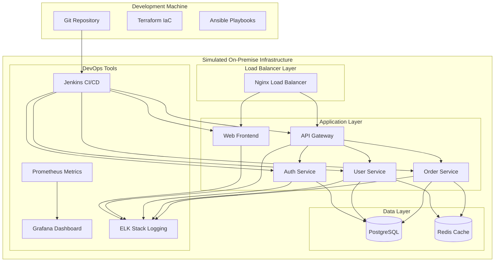

# DevOps Practice Environment Design

## Overview

This design document outlines a comprehensive DevOps Learning Platform that simulates on-premise infrastructure using containerization and infrastructure as code. The platform serves as both a learning management system for DevOps education and a hands-on practice environment. It provides interactive learning modules, quizzes, virtual labs, and real-world scenarios while demonstrating Docker, Ansible, Terraform, Jenkins, Grafana, and Git workflows through a realistic multi-tier web application with microservices architecture.

## Architecture

### High-Level Architecture



### Infrastructure Simulation

The environment uses Docker containers to simulate virtual machines and on-premise infrastructure:

- **Terraform** provisions "infrastructure" by creating Docker networks, volumes, and container definitions
- **Ansible** configures containers as if they were physical servers
- **Docker Compose** orchestrates the entire environment
- **Local networking** simulates on-premise network topology

## Components and Interfaces

### 1. Application Components

#### Web Frontend
- **Technology**: React.js application with learning management features
- **Container**: nginx:alpine serving static files
- **Ports**: 3000 (internal), 80 (external via load balancer)
- **Features**: 
  - Interactive learning modules for DevOps tools
  - Progress tracking dashboard
  - Quiz interface with real-time feedback
  - Lab environment launcher
  - Resource library and documentation
- **Dependencies**: API Gateway for backend communication

#### API Gateway
- **Technology**: Node.js with Express
- **Container**: node:18-alpine
- **Ports**: 4000 (internal)
- **Purpose**: Route requests to appropriate microservices
- **Dependencies**: All microservices

#### Microservices
1. **Learning Management Service**
   - **Technology**: Node.js with Express
   - **Container**: node:18-alpine
   - **Ports**: 4001 (internal)
   - **Purpose**: Manage learning modules, quizzes, and progress tracking
   - **Database**: PostgreSQL learning_content table

2. **User Management Service**
   - **Technology**: Python Flask
   - **Container**: python:3.11-alpine
   - **Ports**: 4002 (internal)
   - **Purpose**: User authentication, profiles, and learning progress
   - **Database**: PostgreSQL users table
   - **Cache**: Redis for session management

3. **Lab Environment Service**
   - **Technology**: Java Spring Boot
   - **Container**: openjdk:17-alpine
   - **Ports**: 4003 (internal)
   - **Purpose**: Provision and manage virtual lab environments
   - **Database**: PostgreSQL lab_sessions table
   - **Integration**: Docker-in-Docker for lab containers

4. **Assessment Service**
   - **Technology**: Python FastAPI
   - **Container**: python:3.11-alpine
   - **Ports**: 4004 (internal)
   - **Purpose**: Handle quizzes, scoring, and certification tracking
   - **Database**: PostgreSQL assessments table

### 2. Data Components

#### PostgreSQL Database
- **Container**: postgres:15-alpine
- **Ports**: 5432 (internal)
- **Volumes**: Persistent data storage
- **Databases**: users, orders, system_logs

#### Redis Cache
- **Container**: redis:7-alpine
- **Ports**: 6379 (internal)
- **Purpose**: Session management and caching

### 3. DevOps Tools

#### Jenkins CI/CD Server
- **Container**: jenkins/jenkins:lts
- **Ports**: 8080 (web UI), 50000 (agent communication)
- **Volumes**: Jenkins home, Docker socket
- **Plugins**: Docker, Git, Pipeline, Blue Ocean

#### Monitoring Stack
1. **Prometheus**
   - **Container**: prom/prometheus:latest
   - **Ports**: 9090 (internal)
   - **Purpose**: Metrics collection

2. **Grafana**
   - **Container**: grafana/grafana:latest
   - **Ports**: 3001 (external)
   - **Purpose**: Metrics visualization

#### Logging Stack (ELK)
1. **Elasticsearch**
   - **Container**: elasticsearch:8.8.0
   - **Ports**: 9200 (internal)
   - **Purpose**: Log storage and indexing

2. **Logstash**
   - **Container**: logstash:8.8.0
   - **Ports**: 5044 (internal)
   - **Purpose**: Log processing

3. **Kibana**
   - **Container**: kibana:8.8.0
   - **Ports**: 5601 (external)
   - **Purpose**: Log visualization

#### Load Balancer
- **Container**: nginx:alpine
- **Ports**: 80 (external), 443 (external)
- **Purpose**: Traffic distribution and SSL termination

## Data Models

### Database Schema

#### Users Table
```sql
CREATE TABLE users (
    id SERIAL PRIMARY KEY,
    username VARCHAR(50) UNIQUE NOT NULL,
    email VARCHAR(100) UNIQUE NOT NULL,
    password_hash VARCHAR(255) NOT NULL,
    learning_progress JSONB DEFAULT '{}',
    current_level VARCHAR(20) DEFAULT 'beginner',
    total_points INTEGER DEFAULT 0,
    created_at TIMESTAMP DEFAULT CURRENT_TIMESTAMP,
    updated_at TIMESTAMP DEFAULT CURRENT_TIMESTAMP
);
```

#### Learning Content Table
```sql
CREATE TABLE learning_content (
    id SERIAL PRIMARY KEY,
    title VARCHAR(200) NOT NULL,
    content_type VARCHAR(50) NOT NULL, -- 'module', 'quiz', 'lab'
    tool_category VARCHAR(50) NOT NULL, -- 'docker', 'ansible', 'terraform', etc.
    difficulty_level VARCHAR(20) NOT NULL,
    content_data JSONB NOT NULL,
    prerequisites TEXT[],
    estimated_duration INTEGER, -- in minutes
    created_at TIMESTAMP DEFAULT CURRENT_TIMESTAMP
);
```

#### Assessments Table
```sql
CREATE TABLE assessments (
    id SERIAL PRIMARY KEY,
    user_id INTEGER REFERENCES users(id),
    content_id INTEGER REFERENCES learning_content(id),
    score INTEGER NOT NULL,
    max_score INTEGER NOT NULL,
    completion_time INTEGER, -- in seconds
    answers JSONB,
    completed_at TIMESTAMP DEFAULT CURRENT_TIMESTAMP
);
```

#### Lab Sessions Table
```sql
CREATE TABLE lab_sessions (
    id SERIAL PRIMARY KEY,
    user_id INTEGER REFERENCES users(id),
    lab_type VARCHAR(50) NOT NULL,
    container_id VARCHAR(100),
    status VARCHAR(20) DEFAULT 'active',
    start_time TIMESTAMP DEFAULT CURRENT_TIMESTAMP,
    end_time TIMESTAMP,
    lab_data JSONB
);
```

### Configuration Models

#### Terraform Variables
```hcl
variable "environment" {
  description = "Environment name (dev, staging, prod)"
  type        = string
  default     = "dev"
}

variable "app_replicas" {
  description = "Number of application replicas"
  type        = number
  default     = 2
}

variable "db_password" {
  description = "Database password"
  type        = string
  sensitive   = true
}
```

#### Ansible Inventory Structure
```yaml
all:
  children:
    web_servers:
      hosts:
        web-01:
          ansible_host: web_container
        web-02:
          ansible_host: web_container_2
    app_servers:
      hosts:
        api-01:
          ansible_host: api_container
        learning-01:
          ansible_host: learning_container
        user-01:
          ansible_host: user_container
        lab-01:
          ansible_host: lab_container
        assessment-01:
          ansible_host: assessment_container
    db_servers:
      hosts:
        db-01:
          ansible_host: postgres_container
    monitoring:
      hosts:
        jenkins-01:
          ansible_host: jenkins_container
        grafana-01:
          ansible_host: grafana_container
```

## Error Handling

### Application Level
- **Service Discovery**: Implement health checks for all services
- **Circuit Breaker**: Use circuit breaker pattern for service-to-service communication
- **Retry Logic**: Implement exponential backoff for failed requests
- **Graceful Degradation**: Services continue operating with reduced functionality

### Infrastructure Level
- **Container Restart Policies**: Automatic restart on failure
- **Health Checks**: Docker health checks for all containers
- **Resource Limits**: CPU and memory limits to prevent resource exhaustion
- **Backup Strategies**: Automated database backups and volume snapshots

### Monitoring and Alerting
- **Prometheus Alerts**: CPU, memory, disk usage thresholds
- **Application Metrics**: Response time, error rate, throughput
- **Log Aggregation**: Centralized logging with error pattern detection
- **Notification Channels**: Email and Slack integration for alerts

## Testing Strategy

### Infrastructure Testing
1. **Terraform Validation**
   - `terraform validate` for syntax checking
   - `terraform plan` for change preview
   - Infrastructure compliance testing

2. **Ansible Testing**
   - Ansible-lint for playbook validation
   - Molecule for role testing
   - Idempotency testing

3. **Container Testing**
   - Docker image security scanning
   - Container health check validation
   - Network connectivity testing

### Application Testing
1. **Unit Tests**
   - Service-specific unit tests
   - Database integration tests
   - API endpoint testing

2. **Integration Tests**
   - Service-to-service communication
   - Database connectivity
   - Cache functionality

3. **End-to-End Tests**
   - User workflow testing
   - Load balancer functionality
   - Complete application flow

### CI/CD Pipeline Testing
1. **Pipeline Validation**
   - Jenkinsfile syntax validation
   - Pipeline stage testing
   - Deployment rollback testing

2. **Environment Testing**
   - Multi-environment deployment
   - Configuration management
   - Secret management

### Monitoring Testing
1. **Metrics Collection**
   - Prometheus target discovery
   - Grafana dashboard functionality
   - Alert rule validation

2. **Log Processing**
   - ELK stack functionality
   - Log parsing and indexing
   - Search and visualization

## Environment Configuration

### Development Environment
- **Purpose**: Local development and testing
- **Resources**: Minimal resource allocation
- **Services**: All services with debug logging
- **Data**: Sample data for testing

### Staging Environment
- **Purpose**: Pre-production testing
- **Resources**: Production-like resource allocation
- **Services**: Production configuration with enhanced logging
- **Data**: Sanitized production data

### Production-like Environment
- **Purpose**: Final validation before deployment
- **Resources**: Full production resource allocation
- **Services**: Production configuration
- **Data**: Full dataset simulation

## Security Considerations

### Container Security
- **Base Images**: Use official, minimal base images
- **User Privileges**: Run containers as non-root users
- **Network Segmentation**: Isolated networks for different tiers
- **Secret Management**: Use Docker secrets for sensitive data

### Application Security
- **Authentication**: JWT-based authentication
- **Authorization**: Role-based access control
- **Data Encryption**: Encrypt data in transit and at rest
- **Input Validation**: Validate all user inputs

### Infrastructure Security
- **Network Policies**: Restrict inter-service communication
- **Firewall Rules**: Limit external access points
- **SSL/TLS**: Encrypt all external communications
- **Audit Logging**: Log all administrative actions